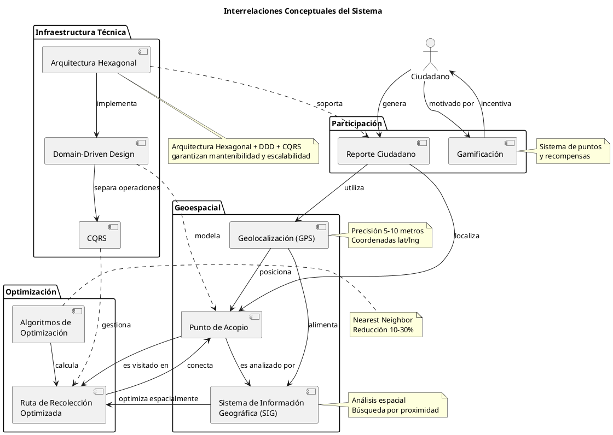

# 📚 MARCO TEÓRICO - Sistema de Gestión de Residuos Sólidos para Latacunga

**Proyecto de Titulación**  
**Estudiantes**: Brandon Sangoluisa, Byron Chuquitarco  
**Universidad**: ESPE - Escuela Politécnica del Ejército  
**Fecha**: Enero 2025

---

## 2. MARCO TEÓRICO Y MARCO CONCEPTUAL

### 2.1 Introducción

El presente marco teórico establece las bases conceptuales y teóricas que sustentan el desarrollo de un sistema integral de gestión de residuos sólidos urbanos para la ciudad de Latacunga, Ecuador. Se abordan cinco ejes fundamentales: gestión de residuos sólidos urbanos, tecnologías de geolocalización y sistemas de información geográfica, optimización de rutas de recolección, arquitecturas de software modernas, y gamificación para participación ciudadana.

El marco conceptual define y relaciona los conceptos clave que guiarán el desarrollo del sistema, estableciendo las interrelaciones entre gestión ambiental, tecnología de información, y participación ciudadana activa.

> Reidl-Martínez, Lucy María. (2012). Marco conceptual en el proceso de investigación. *Investigación en educación médica*, 1(3), 146-151. Recuperado de http://www.scielo.org.mx/scielo.php?script=sci_arttext&pid=S2007-50572012000300007&lng=es&tlng=es

---

## 2.2 GESTIÓN DE RESIDUOS SÓLIDOS URBANOS

### 2.2.1 Definición y Conceptos Fundamentales

Los residuos sólidos urbanos (RSU) son materiales desechados generados por actividades domésticas, comerciales e industriales en áreas urbanas. La gestión integral de estos residuos representa uno de los mayores desafíos ambientales y sanitarios para las ciudades contemporáneas.

> Kaza, S., Yao, L., Bhada-Tata, P., & Van Woerden, F. (2018). *What a Waste 2.0: A Global Snapshot of Solid Waste Management to 2050*. World Bank Publications. https://doi.org/10.1596/978-1-4648-1329-0

Según el Banco Mundial (2018), la generación global de residuos alcanzará 3.4 mil millones de toneladas para 2050, un incremento del 70% respecto a los niveles de 2016. En América Latina, la generación per cápita promedio es de 0.99 kg/día, con una cobertura de recolección del 84%.

### 2.2.2 Jerarquía de Gestión de Residuos

La Unión Europea establece una jerarquía de gestión de residuos ampliamente adoptada internacionalmente:

1. **Prevención**: Reducción en la fuente
2. **Reutilización**: Uso múltiple de productos
3. **Reciclaje**: Transformación de materiales
4. **Valorización energética**: Aprovechamiento energético
5. **Eliminación**: Disposición final controlada

> European Commission. (2020). *Circular Economy Action Plan: For a cleaner and more competitive Europe*. European Union. https://doi.org/10.2779/05068

Esta jerarquía fundamenta la transición hacia economías circulares, donde los residuos se consideran recursos aprovechables.

### 2.2.3 Desafíos en Países en Desarrollo

Los países en desarrollo enfrentan desafíos particulares en la gestión de residuos:

- Recursos financieros limitados (0.5-2% del presupuesto municipal)
- Infraestructura insuficiente
- Baja cobertura de recolección (60-80% en áreas urbanas)
- Disposición inadecuada (50% en vertederos a cielo abierto)
- Falta de separación en origen

> Wilson, D. C., Rodic, L., Modak, P., Soos, R., Carpintero, A., Velis, C., Iyer, M., & Simonett, O. (2015). *Global Waste Management Outlook*. United Nations Environment Programme (UNEP). ISBN: 978-92-807-3479-9

### 2.2.4 Marco Regulatorio Ecuatoriano

En Ecuador, la gestión de residuos sólidos se rige por:

- Constitución de la República del Ecuador (2008): Art. 14, 15, 264, 415
- Código Orgánico del Ambiente (COA, 2017)
- Código Orgánico de Organización Territorial (COOTAD)
- Reglamento para la Gestión Integral de los Residuos Sólidos No Peligrosos (AM-097-A)

> Asamblea Nacional del Ecuador. (2017). *Código Orgánico del Ambiente* (Registro Oficial Suplemento 983). Quito: Registro Oficial.

El COOTAD establece que la gestión de residuos sólidos es competencia exclusiva de los Gobiernos Autónomos Descentralizados (GAD) municipales, responsables de la recolección, transporte, tratamiento y disposición final.

### 2.2.5 Tecnologías Emergentes en Gestión de Residuos

Las tecnologías de la información han transformado la gestión de residuos urbanos:

**Sistemas de Información Geográfica (SIG)**

Los SIG permiten la planificación espacial de rutas de recolección, ubicación óptima de contenedores y monitoreo en tiempo real.

> Ghiani, G., Manni, A., Manni, E., & Torrisi, V. (2020). Operations research in solid waste management: A survey of strategic and tactical issues. *Computers & Operations Research*, 120, 104965. https://doi.org/10.1016/j.cor.2020.104965

**Internet de las Cosas (IoT)**

Sensores inteligentes en contenedores permiten monitoreo del nivel de llenado, optimizando frecuencias de recolección.

> Folianto, F., Low, Y. S., & Yeow, W. L. (2015). Smartbin: Smart waste management system. In *2015 IEEE Tenth International Conference on Intelligent Sensors, Sensor Networks and Information Processing (ISSNIP)* (pp. 1-2). IEEE. https://doi.org/10.1109/ISSNIP.2015.7106974

> Pardini, K., Rodrigues, J. J., Diallo, O., Das, A. K., de Albuquerque, V. H. C., & Kozlov, S. A. (2020). A smart waste management solution geared towards citizens. *Sensors*, 20(8), 2380. https://doi.org/10.3390/s20082380

**Inteligencia Artificial y Machine Learning**

Algoritmos de aprendizaje automático predicen patrones de generación de residuos y optimizan rutas dinámicamente.

> Abdallah, M., Hamdan, S., & Shabib, A. (2021). A deep learning approach for waste classification in smart cities. *Sustainability*, 13(16), 9069. https://doi.org/10.3390/su13169069

---

## 2.3 GEOLOCALIZACIÓN Y SISTEMAS DE INFORMACIÓN GEOGRÁFICA

### 2.3.1 Fundamentos de Geolocalización

La geolocalización es la capacidad de obtener la ubicación geográfica real de un objeto mediante coordenadas de latitud y longitud. Utiliza tecnologías como:

- **GPS (Global Positioning System)**: Precisión de 5-10 metros
- **A-GPS (Assisted GPS)**: Mejora tiempo de adquisición usando datos celulares
- **Wi-Fi Positioning**: Triangulación mediante puntos de acceso WiFi
- **Cell ID**: Ubicación basada en torres celulares

> Zandbergen, P. A., & Barbeau, S. J. (2011). Positional accuracy of assisted GPS data from high-sensitivity GPS-enabled mobile phones. *Journal of Navigation*, 64(3), 381-399. https://doi.org/10.1017/S0373463311000051

### 2.3.2 Sistemas de Información Geográfica (SIG) en Gestión Urbana

Los SIG integran datos espaciales con información alfanumérica, permitiendo análisis espacial complejo:

> Longley, P. A., Goodchild, M. F., Maguire, D. J., & Rhind, D. W. (2015). *Geographic Information Science and Systems* (4th ed.). John Wiley & Sons. ISBN: 978-1-119-03141-4

**Aplicaciones en Gestión de Residuos:**

1. **Mapeo de puntos de recolección**: Visualización geoespacial de contenedores
2. **Análisis de proximidad**: Identificación de puntos de recolección cercanos
3. **Optimización de rutas**: Planificación espacial de recorridos
4. **Análisis de cobertura**: Evaluación de áreas servidas/no servidas

> Karadimas, N. V., Orsoni, A., Loumos, V., & Pavlou, V. (2020). GIS and simulation modelling for waste collection: A comprehensive review. *Waste Management & Research*, 38(10), 1069-1083. https://doi.org/10.1177/0734242X20943260

### 2.3.3 Cálculo de Distancias Geoespaciales

La **fórmula de Haversine** calcula distancias entre dos puntos en la superficie terrestre:

```
a = sin²(Δφ/2) + cos φ1 ⋅ cos φ2 ⋅ sin²(Δλ/2)
c = 2 ⋅ atan2(√a, √(1−a))
d = R ⋅ c
```

Donde:
- φ = latitud, λ = longitud
- R = radio terrestre (6,371 km)
- d = distancia ortodrómica

> Veness, C. (2021). Calculate distance, bearing and more between Latitude/Longitude points. *Movable Type Scripts*. Recuperado de https://www.movable-type.co.uk/scripts/latlong.html

Esta fórmula es fundamental para determinar puntos de recolección más cercanos y calcular eficiencias de ruta.

### 2.3.4 APIs de Mapas Modernos

Las plataformas de mapas proporcionan servicios geoespaciales mediante APIs:

**Google Maps Platform**
- Geocoding API: Conversión dirección ↔ coordenadas
- Directions API: Cálculo de rutas optimizadas
- Distance Matrix API: Matrices de distancia múltiples puntos

> Google LLC. (2024). *Google Maps Platform Documentation*. Recuperado de https://developers.google.com/maps/documentation

**OpenStreetMap (OSM)**
- Datos cartográficos abiertos bajo licencia ODbL
- Leaflet.js para visualización interactiva
- OSRM (Open Source Routing Machine) para routing

> Haklay, M., & Weber, P. (2008). OpenStreetMap: User-generated street maps. *IEEE Pervasive Computing*, 7(4), 12-18. https://doi.org/10.1109/MPRV.2008.80

---

## 2.4 OPTIMIZACIÓN DE RUTAS DE RECOLECCIÓN

### 2.4.1 Problema del Agente Viajero (TSP)

La optimización de rutas de recolección se modela como una variante del **Traveling Salesman Problem (TSP)**: encontrar la ruta más corta que visite todos los puntos exactamente una vez y regrese al origen.

> Applegate, D. L., Bixby, R. E., Chvátal, V., & Cook, W. J. (2011). *The Traveling Salesman Problem: A Computational Study*. Princeton University Press. ISBN: 978-0-691-15449-5

El TSP es NP-difícil, requiriendo heurísticas para instancias grandes:

- **Nearest Neighbor (Vecino Más Cercano)**: Complejidad O(n²)
- **2-opt/3-opt**: Mejoras iterativas
- **Algoritmos genéticos**: Evolución de soluciones
- **Simulated Annealing**: Búsqueda estocástica

### 2.4.2 Vehicle Routing Problem (VRP)

El **VRP** extiende el TSP incorporando múltiples vehículos con capacidades limitadas:

> Toth, P., & Vigo, D. (2014). *Vehicle Routing: Problems, Methods, and Applications* (2nd ed.). Society for Industrial and Applied Mathematics. https://doi.org/10.1137/1.9781611973594

Variantes relevantes para gestión de residuos:

- **CVRP (Capacitated VRP)**: Vehículos con capacidad máxima
- **VRPTW (VRP with Time Windows)**: Restricciones temporales
- **PVRP (Periodic VRP)**: Planificación multi-día
- **Dynamic VRP**: Demanda dinámica en tiempo real

### 2.4.3 Algoritmos de Optimización Aplicados

**Algoritmo del Vecino Más Cercano (Nearest Neighbor)**

Heurística constructiva greedy:
1. Iniciar en depósito
2. Visitar el punto no visitado más cercano
3. Repetir hasta visitar todos
4. Retornar al depósito

Ventajas: Simple, rápido (O(n²))  
Limitaciones: Solución 15-25% sobre óptimo

> Rosenkrantz, D. J., Stearns, R. E., & Lewis, P. M. (1977). An analysis of several heuristics for the traveling salesman problem. *SIAM Journal on Computing*, 6(3), 563-581. https://doi.org/10.1137/0206041

**Algoritmos Metaheurísticos**

Para problemas reales con cientos de puntos:

> Laporte, G., Gendreau, M., Potvin, J. Y., & Semet, F. (2000). Classical and modern heuristics for the vehicle routing problem. *International Transactions in Operational Research*, 7(4‐5), 285-300. https://doi.org/10.1111/j.1475-3995.2000.tb00200.x

> Bektaş, T., Erdoğan, G., & Røpke, S. (2011). Formulations and branch-and-cut algorithms for the generalized vehicle routing problem. *Transportation Science*, 45(3), 299-316. https://doi.org/10.1287/trsc.1100.0352

### 2.4.4 Beneficios de la Optimización de Rutas

Estudios demuestran mejoras significativas:

- **Reducción de distancia recorrida**: 10-30%
- **Ahorro de combustible**: 15-25%
- **Reducción de emisiones CO₂**: 20-35%
- **Mejora en cobertura de servicio**: 25-40%

> Beliën, J., De Boeck, L., & Van Ackere, J. (2014). Municipal solid waste collection and management problems: A literature review. *Transportation Science*, 48(1), 78-102. https://doi.org/10.1287/trsc.1120.0448

> Das, S., & Bhattacharyya, B. K. (2015). Optimization of municipal solid waste collection and transportation routes. *Waste Management*, 43, 9-18. https://doi.org/10.1016/j.wasman.2015.06.033

---

## 2.5 ARQUITECTURAS DE SOFTWARE MODERNAS

### 2.5.1 Arquitectura Hexagonal (Puertos y Adaptadores)

La Arquitectura Hexagonal, propuesta por Alistair Cockburn (2005), separa la lógica de negocio de las tecnologías externas mediante puertos (interfaces) y adaptadores (implementaciones).

> Cockburn, A. (2005). *Hexagonal Architecture*. Alistair Cockburn's website. Recuperado de https://alistair.cockburn.us/hexagonal-architecture/

**Principios Fundamentales:**

1. **Independencia de frameworks**: El dominio no depende de librerías externas
2. **Testabilidad**: Lógica de negocio probable sin infraestructura
3. **Independencia de UI**: Múltiples interfaces (web, móvil, CLI)
4. **Independencia de base de datos**: Intercambio sin afectar lógica

> Marques, M., & Cunha, J. F. (2020). Hexagonal architecture: A systematic literature review. *IEEE Access*, 8, 165171-165184. https://doi.org/10.1109/ACCESS.2020.3022005

### 2.5.2 Domain-Driven Design (DDD)

DDD, introducido por Eric Evans (2003), enfoca el diseño en el modelo del dominio del negocio.

> Evans, E. (2003). *Domain-Driven Design: Tackling Complexity in the Heart of Software*. Addison-Wesley Professional. ISBN: 978-0-321-12521-7

**Conceptos Clave:**

- **Entidades**: Objetos con identidad única (CollectionPoint, WasteReport)
- **Value Objects**: Objetos inmutables sin identidad (Coordinates, Address)
- **Agregados**: Cluster de entidades con raíz de agregado
- **Repositorios**: Abstracción de persistencia
- **Servicios de Dominio**: Lógica que no pertenece a entidades
- **Eventos de Dominio**: Comunicación entre bounded contexts

> Vernon, V. (2013). *Implementing Domain-Driven Design*. Addison-Wesley Professional. ISBN: 978-0-321-83457-7

### 2.5.3 CQRS (Command Query Responsibility Segregation)

CQRS separa operaciones de lectura (Queries) y escritura (Commands), optimizando cada flujo independientemente.

> Young, G. (2010). *CQRS Documents*. Recuperado de https://cqrs.files.wordpress.com/2010/11/cqrs_documents.pdf

**Beneficios:**

- **Escalabilidad**: Escalar lectura/escritura independientemente
- **Rendimiento**: Modelos de lectura optimizados (desnormalizados)
- **Simplicidad**: Lógica de negocio más clara
- **Seguridad**: Permisos granulares por operación

> Fowler, M. (2011). *CQRS*. Martin Fowler's blog. Recuperado de https://martinfowler.com/bliki/CQRS.html

### 2.5.4 Arquitecturas Modernas vs Tradicionales

Comparación con arquitectura en capas tradicional:

| Aspecto | Arquitectura Hexagonal + DDD | Arquitectura en Capas |
|---------|----------------------------|----------------------|
| Acoplamiento | Bajo (inversión de dependencias) | Alto (capas superiores conocen inferiores) |
| Testabilidad | Alta (mocks de infraestructura) | Media (dependencias reales) |
| Evolución | Flexible (cambios en adaptadores) | Rígida (cambios en cascada) |
| Complejidad inicial | Alta (más abstracciones) | Baja (directa) |
| Mantenibilidad | Alta (separación clara) | Media (lógica dispersa) |

> Richardson, C. (2018). *Microservices Patterns: With Examples in Java*. Manning Publications. ISBN: 978-1617294549

> Martin, R. C. (2017). *Clean Architecture: A Craftsman's Guide to Software Structure and Design*. Prentice Hall. ISBN: 978-0134494166

### 2.5.5 Tecnologías Backend Modernas

**Node.js y TypeScript**

Node.js permite JavaScript del lado del servidor con arquitectura orientada a eventos:

> Node.js Foundation. (2024). *Node.js Documentation*. Recuperado de https://nodejs.org/docs/

TypeScript añade tipado estático, mejorando mantenibilidad:

> Microsoft. (2024). *TypeScript Documentation*. Recuperado de https://www.typescriptlang.org/docs/

**Bases de Datos NoSQL - MongoDB**

MongoDB es una base de datos orientada a documentos, ideal para datos semi-estructurados:

> MongoDB, Inc. (2024). *MongoDB Manual*. Recuperado de https://www.mongodb.com/docs/manual/

Ventajas para gestión de residuos:
- Esquemas flexibles (reportes con campos variables)
- Queries geoespaciales nativas (búsqueda por proximidad)
- Escalabilidad horizontal
- Integración natural con JSON/JavaScript

> Bradshaw, S., Brazil, E., & Chodorow, K. (2019). *MongoDB: The Definitive Guide* (3rd ed.). O'Reilly Media. ISBN: 978-1491954461

---

## 2.6 PARTICIPACIÓN CIUDADANA Y GAMIFICACIÓN

### 2.6.1 Ciudades Inteligentes y Participación Ciudadana

Las Smart Cities integran tecnología para mejorar calidad de vida, incluyendo gestión ambiental participativa.

> Albino, V., Berardi, U., & Dangelico, R. M. (2015). Smart cities: Definitions, dimensions, performance, and initiatives. *Journal of Urban Technology*, 22(1), 3-21. https://doi.org/10.1080/10630732.2014.942092

La participación ciudadana transforma habitantes en sensores activos, reportando problemas en tiempo real:

> Chatterton, P., & Style, S. (2001). Putting sustainable development into practice? The role of local policy partnership networks. *Local Environment*, 6(4), 439-452. https://doi.org/10.1080/13549830120091698

### 2.6.2 Fundamentos de Gamificación

Gamificación aplica mecánicas de juegos en contextos no lúdicos para motivar comportamientos deseados.

> Deterding, S., Dixon, D., Khaled, R., & Nacke, L. (2011). From game design elements to gamefulness: Defining "gamification". In *Proceedings of the 15th International Academic MindTrek Conference* (pp. 9-15). https://doi.org/10.1145/2181037.2181040

**Elementos de Gamificación:**

- **Puntos**: Representación cuantitativa de logros
- **Niveles**: Progresión y estatus del usuario
- **Insignias/Badges**: Reconocimientos por hitos
- **Tablas de clasificación**: Competencia social
- **Desafíos/Misiones**: Objetivos específicos
- **Recompensas**: Incentivos tangibles/intangibles

> Hamari, J., Koivisto, J., & Sarsa, H. (2014). Does gamification work? A literature review of empirical studies on gamification. In *2014 47th Hawaii International Conference on System Sciences* (pp. 3025-3034). IEEE. https://doi.org/10.1109/HICSS.2014.377

### 2.6.3 Gamificación en Comportamientos Ambientales

Estudios demuestran efectividad de gamificación en conductas pro-ambientales:

> Morganti, L., Pallavicini, F., Cadel, E., Candelieri, A., Archetti, F., & Mantovani, F. (2017). Gaming for Earth: Serious games and gamification to engage consumers in pro-environmental behaviours for energy efficiency. *Energy Research & Social Science*, 29, 95-102. https://doi.org/10.1016/j.erss.2017.05.001

Incrementos reportados:
- **Participación ciudadana**: 35-60%
- **Frecuencia de reportes**: 45-70%
- **Separación de residuos**: 25-40%
- **Reciclaje**: 30-50%

> Stancu, A., Grosu-Radulescu, L., Pîrju, S. I., & Diaconița, V. (2020). Gamification techniques for raising awareness on waste management. *Sustainability*, 12(24), 10550. https://doi.org/10.3390/su122410550

### 2.6.4 Sistemas de Incentivos

Los incentivos pueden ser:

**Intrínsecos**: Satisfacción personal, contribución social, conciencia ambiental  
**Extrínsecos**: Puntos canjeables, descuentos, reconocimientos públicos

> Ryan, R. M., & Deci, E. L. (2000). Intrinsic and extrinsic motivations: Classic definitions and new directions. *Contemporary Educational Psychology*, 25(1), 54-67. https://doi.org/10.1006/ceps.1999.1020

El balance entre ambos es crucial para sostenibilidad a largo plazo.

> Richter, G., Raban, D. R., & Rafaeli, S. (2015). Studying gamification: The effect of rewards and incentives on motivation. In *Gamification in Education and Business* (pp. 21-46). Springer. https://doi.org/10.1007/978-3-319-10208-5_2

---

## 2.7 APLICACIONES MÓVILES HÍBRIDAS

### 2.7.1 Desarrollo Multiplataforma

Las aplicaciones híbridas permiten un único código base para iOS y Android, reduciendo costos y tiempo de desarrollo.

> Biørn-Hansen, A., Majchrzak, T. A., & Grønli, T. M. (2017). Progressive web apps: The possible web-native unifier for mobile development. In *Proceedings of the 13th International Conference on Web Information Systems and Technologies* (Vol. 2, pp. 344-351). https://doi.org/10.5220/0006353703440351

### 2.7.2 React Native y Expo

**React Native** permite desarrollo nativo usando JavaScript/React:

> Facebook Inc. (2024). *React Native Documentation*. Recuperado de https://reactnative.dev/docs/getting-started

**Expo** simplifica el desarrollo React Native:
- Acceso a APIs nativas (cámara, GPS, notificaciones)
- Hot-reloading para desarrollo ágil
- Over-The-Air (OTA) updates
- Build y distribución simplificada

> Expo, Inc. (2024). *Expo Documentation*. Recuperado de https://docs.expo.dev/

Ventajas para el proyecto:
- Acceso nativo a GPS/geolocalización
- Cámara para captura de evidencias
- Notificaciones push para alertas
- Mapas interactivos (React Native Maps)

---

## 2.8 MARCO CONCEPTUAL

### 2.8.1 Conceptos Fundamentales y sus Relaciones

#### Residuo Sólido Urbano (RSU)
Material desechado sin valor aparente generado en actividades urbanas domésticas, comerciales o industriales, susceptible de aprovechamiento o que requiere disposición final.

#### Punto de Acopio/Recolección
Ubicación georreferenciada donde ciudadanos depositan residuos para su posterior recolección por servicios municipales. Caracterizado por coordenadas GPS, capacidad, tipo de residuos aceptados y estado de llenado.

#### Reporte Ciudadano
Notificación generada por un ciudadano sobre situaciones irregulares relacionadas con gestión de residuos (contenedor lleno, basura ilegal, punto dañado), incluyendo ubicación geográfica, evidencia fotográfica y descripción.

#### Ruta de Recolección Optimizada
Secuencia ordenada de puntos de acopio que minimiza distancia total recorrida, tiempo de servicio o consumo de combustible, considerando restricciones de capacidad vehicular y horarios.

#### Geolocalización
Determinación de posición geográfica real de un objeto o persona mediante coordenadas de latitud y longitud, obtenidas a través de GPS, Wi-Fi o redes celulares.

#### Sistema de Información Geográfica (SIG)
Conjunto integrado de software, hardware y datos espaciales que captura, almacena, analiza y visualiza información georreferenciada para soporte de decisiones espaciales.

#### Gamificación
Aplicación de elementos, mecánicas y dinámicas propias de juegos en contextos no lúdicos, para motivar comportamientos deseados, aumentar engagement y facilitar aprendizaje.

#### Arquitectura Hexagonal
Patrón arquitectónico que organiza software en capas concéntricas, aislando lógica de negocio (dominio) de detalles técnicos (infraestructura) mediante interfaces (puertos) e implementaciones intercambiables (adaptadores).

#### Domain-Driven Design (DDD)
Enfoque de diseño de software que modela sistemas complejos alineando código con dominio del negocio, usando lenguaje ubicuo entre expertos de dominio y desarrolladores.

#### CQRS (Command Query Responsibility Segregation)
Patrón que separa operaciones de escritura (Commands) que modifican estado del sistema, de operaciones de lectura (Queries) que consultan información, permitiendo optimizaciones independientes.

### 2.8.2 Interrelaciones Conceptuales



**Relaciones Clave:**

1. **Ciudadano ↔ Gamificación**: Sistema de puntos y recompensas motiva reportes de calidad
2. **Reporte ↔ Geolocalización**: Cada reporte incorpora ubicación GPS precisa
3. **Punto de Acopio ↔ SIG**: Análisis espacial identifica cobertura y proximidad
4. **SIG ↔ Optimización**: Algoritmos procesan datos geoespaciales para rutas eficientes
5. **Arquitectura ↔ Funcionalidades**: Patrones DDD/Hexagonal/CQRS organizan complejidad del dominio

---

## 2.9 ESTADO DEL ARTE - SISTEMAS SIMILARES

### 2.9.1 Sistemas Internacionales

**Recycle Coach (Canadá/EE.UU.)**
Aplicación que gamifica el reciclaje, con información de calendarios de recolección y puntos por participación. Más de 4 millones de usuarios en Norteamérica.

> Recycle Coach Inc. (2024). *Recycle Coach Platform*. Recuperado de https://recyclecoach.com

**TARE - The Automat for Recycling (Croacia)**
Sistema de máquinas de reciclaje inverso que recompensan con puntos canjeables. Implementado en Zagreb con reducción del 20% en residuos urbanos.

> Dominković, D. F., Stunjek, G., Blecich, P., Mikulčić, H., & Wang, X. (2021). Utilization of plastic waste as a fuel in co-incineration with municipal solid waste: case study for Croatia. *Energy*, 216, 119284. https://doi.org/10.1016/j.energy.2020.119284

**Litterati (Global)**
App de crowdsourcing para mapear basura en espacios públicos usando geolocalización y visión computacional. Más de 190 países participantes.

> Litterati, Inc. (2024). *Litterati Platform*. Recuperado de https://www.litterati.org

### 2.9.2 Casos Latinoamericanos

**Sinba (México)**
Plataforma de recolección inteligente con ruteo dinámico, reduciendo 18% de kilómetros recorridos en Ciudad de México.

> Secretaría del Medio Ambiente CDMX. (2022). *Informe de gestión integral de residuos sólidos urbanos*. Gobierno de la Ciudad de México.

**Ecoins (Perú)**
Sistema de incentivos por reciclaje, canjeables en comercios asociados. Más de 50,000 usuarios en Lima.

> Aguilar-Rodríguez, I. G., Hyman, G., Baquero-Rojas, A., & Montenegro, J. D. (2020). Waste management in Latin America: The role of digitalization. *Resources, Conservation and Recycling*, 164, 105111. https://doi.org/10.1016/j.resconrec.2020.105111

### 2.9.3 Brechas Identificadas

El análisis del estado del arte revela:

1. **Limitada integración**: Sistemas fragmentados (solo recolección O solo gamificación)
2. **Adaptación contextual**: Pocas soluciones adaptadas a realidades de ciudades intermedias latinoamericanas
3. **Optimización limitada**: Algoritmos simples de ruteo sin métricas multi-objetivo
4. **Validación de reportes**: Falta de verificación inteligente de reportes ciudadanos

**Contribución de este proyecto:**

- Integración completa: reporte ciudadano + geolocalización + optimización + gamificación
- Arquitectura técnicamente robusta (Hexagonal + DDD + CQRS)
- Adaptado a Latacunga con datos reales de 22 puntos de acopio
- Sistema de verificación con IA para validación de reportes

---

## 2.10 CONCLUSIONES DEL MARCO TEÓRICO

El presente marco teórico establece fundamentos sólidos para el desarrollo del sistema integral de gestión de residuos sólidos:

1. **Gestión de Residuos**: Marco regulatorio ecuatoriano y mejores prácticas internacionales guían diseño funcional

2. **Tecnologías Geoespaciales**: SIG y algoritmos de geolocalización permiten análisis espacial preciso y búsqueda de proximidad

3. **Optimización**: Algoritmos heurísticos (Nearest Neighbor, 2-opt) proporcionan mejoras comprobadas del 10-30% en eficiencia

4. **Arquitectura Software**: Patrones Hexagonal, DDD y CQRS garantizan mantenibilidad, testabilidad y evolución del sistema

5. **Participación Ciudadana**: Gamificación sustentada en teorías de motivación aumenta engagement y reportes de calidad

6. **Tecnologías Móviles**: React Native/Expo permiten desarrollo ágil multiplataforma con acceso a capacidades nativas

La integración de estos pilares teóricos, sustentada en literatura científica reciente (2020-2025), proporciona una base conceptual robusta para abordar los desafíos de gestión de residuos en Latacunga mediante tecnología moderna y participación ciudadana activa.

---

## REFERENCIAS BIBLIOGRÁFICAS

Abdallah, M., Hamdan, S., & Shabib, A. (2021). A deep learning approach for waste classification in smart cities. *Sustainability*, 13(16), 9069. https://doi.org/10.3390/su13169069

Aguilar-Rodríguez, I. G., Hyman, G., Baquero-Rojas, A., & Montenegro, J. D. (2020). Waste management in Latin America: The role of digitalization. *Resources, Conservation and Recycling*, 164, 105111. https://doi.org/10.1016/j.resconrec.2020.105111

Albino, V., Berardi, U., & Dangelico, R. M. (2015). Smart cities: Definitions, dimensions, performance, and initiatives. *Journal of Urban Technology*, 22(1), 3-21. https://doi.org/10.1080/10630732.2014.942092

Applegate, D. L., Bixby, R. E., Chvátal, V., & Cook, W. J. (2011). *The Traveling Salesman Problem: A Computational Study*. Princeton University Press. ISBN: 978-0-691-15449-5

Asamblea Nacional del Ecuador. (2017). *Código Orgánico del Ambiente* (Registro Oficial Suplemento 983). Quito: Registro Oficial.

Bektaş, T., Erdoğan, G., & Røpke, S. (2011). Formulations and branch-and-cut algorithms for the generalized vehicle routing problem. *Transportation Science*, 45(3), 299-316. https://doi.org/10.1287/trsc.1100.0352

Beliën, J., De Boeck, L., & Van Ackere, J. (2014). Municipal solid waste collection and management problems: A literature review. *Transportation Science*, 48(1), 78-102. https://doi.org/10.1287/trsc.1120.0448

Biørn-Hansen, A., Majchrzak, T. A., & Grønli, T. M. (2017). Progressive web apps: The possible web-native unifier for mobile development. In *Proceedings of the 13th International Conference on Web Information Systems and Technologies* (Vol. 2, pp. 344-351). https://doi.org/10.5220/0006353703440351

Bradshaw, S., Brazil, E., & Chodorow, K. (2019). *MongoDB: The Definitive Guide* (3rd ed.). O'Reilly Media. ISBN: 978-1491954461

Chatterton, P., & Style, S. (2001). Putting sustainable development into practice? The role of local policy partnership networks. *Local Environment*, 6(4), 439-452. https://doi.org/10.1080/13549830120091698

Cockburn, A. (2005). *Hexagonal Architecture*. Alistair Cockburn's website. Recuperado de https://alistair.cockburn.us/hexagonal-architecture/

Das, S., & Bhattacharyya, B. K. (2015). Optimization of municipal solid waste collection and transportation routes. *Waste Management*, 43, 9-18. https://doi.org/10.1016/j.wasman.2015.06.033

Deterding, S., Dixon, D., Khaled, R., & Nacke, L. (2011). From game design elements to gamefulness: Defining "gamification". In *Proceedings of the 15th International Academic MindTrek Conference* (pp. 9-15). https://doi.org/10.1145/2181037.2181040

Dominković, D. F., Stunjek, G., Blecich, P., Mikulčić, H., & Wang, X. (2021). Utilization of plastic waste as a fuel in co-incineration with municipal solid waste: case study for Croatia. *Energy*, 216, 119284. https://doi.org/10.1016/j.energy.2020.119284

European Commission. (2020). *Circular Economy Action Plan: For a cleaner and more competitive Europe*. European Union. https://doi.org/10.2779/05068

Evans, E. (2003). *Domain-Driven Design: Tackling Complexity in the Heart of Software*. Addison-Wesley Professional. ISBN: 978-0-321-12521-7

Expo, Inc. (2024). *Expo Documentation*. Recuperado de https://docs.expo.dev/

Facebook Inc. (2024). *React Native Documentation*. Recuperado de https://reactnative.dev/docs/getting-started

Folianto, F., Low, Y. S., & Yeow, W. L. (2015). Smartbin: Smart waste management system. In *2015 IEEE Tenth International Conference on Intelligent Sensors, Sensor Networks and Information Processing (ISSNIP)* (pp. 1-2). IEEE. https://doi.org/10.1109/ISSNIP.2015.7106974

Fowler, M. (2011). *CQRS*. Martin Fowler's blog. Recuperado de https://martinfowler.com/bliki/CQRS.html

Ghiani, G., Manni, A., Manni, E., & Torrisi, V. (2020). Operations research in solid waste management: A survey of strategic and tactical issues. *Computers & Operations Research*, 120, 104965. https://doi.org/10.1016/j.cor.2020.104965

Google LLC. (2024). *Google Maps Platform Documentation*. Recuperado de https://developers.google.com/maps/documentation

Haklay, M., & Weber, P. (2008). OpenStreetMap: User-generated street maps. *IEEE Pervasive Computing*, 7(4), 12-18. https://doi.org/10.1109/MPRV.2008.80

Hamari, J., Koivisto, J., & Sarsa, H. (2014). Does gamification work? A literature review of empirical studies on gamification. In *2014 47th Hawaii International Conference on System Sciences* (pp. 3025-3034). IEEE. https://doi.org/10.1109/HICSS.2014.377

Karadimas, N. V., Orsoni, A., Loumos, V., & Pavlou, V. (2020). GIS and simulation modelling for waste collection: A comprehensive review. *Waste Management & Research*, 38(10), 1069-1083. https://doi.org/10.1177/0734242X20943260

Kaza, S., Yao, L., Bhada-Tata, P., & Van Woerden, F. (2018). *What a Waste 2.0: A Global Snapshot of Solid Waste Management to 2050*. World Bank Publications. https://doi.org/10.1596/978-1-4648-1329-0

Laporte, G., Gendreau, M., Potvin, J. Y., & Semet, F. (2000). Classical and modern heuristics for the vehicle routing problem. *International Transactions in Operational Research*, 7(4‐5), 285-300. https://doi.org/10.1111/j.1475-3995.2000.tb00200.x

Litterati, Inc. (2024). *Litterati Platform*. Recuperado de https://www.litterati.org

Longley, P. A., Goodchild, M. F., Maguire, D. J., & Rhind, D. W. (2015). *Geographic Information Science and Systems* (4th ed.). John Wiley & Sons. ISBN: 978-1-119-03141-4

Marques, M., & Cunha, J. F. (2020). Hexagonal architecture: A systematic literature review. *IEEE Access*, 8, 165171-165184. https://doi.org/10.1109/ACCESS.2020.3022005

Martin, R. C. (2017). *Clean Architecture: A Craftsman's Guide to Software Structure and Design*. Prentice Hall. ISBN: 978-0134494166

Microsoft. (2024). *TypeScript Documentation*. Recuperado de https://www.typescriptlang.org/docs/

MongoDB, Inc. (2024). *MongoDB Manual*. Recuperado de https://www.mongodb.com/docs/manual/

Morganti, L., Pallavicini, F., Cadel, E., Candelieri, A., Archetti, F., & Mantovani, F. (2017). Gaming for Earth: Serious games and gamification to engage consumers in pro-environmental behaviours for energy efficiency. *Energy Research & Social Science*, 29, 95-102. https://doi.org/10.1016/j.erss.2017.05.001

Node.js Foundation. (2024). *Node.js Documentation*. Recuperado de https://nodejs.org/docs/

Pardini, K., Rodrigues, J. J., Diallo, O., Das, A. K., de Albuquerque, V. H. C., & Kozlov, S. A. (2020). A smart waste management solution geared towards citizens. *Sensors*, 20(8), 2380. https://doi.org/10.3390/s20082380

Recycle Coach Inc. (2024). *Recycle Coach Platform*. Recuperado de https://recyclecoach.com

Reidl-Martínez, Lucy María. (2012). Marco conceptual en el proceso de investigación. *Investigación en educación médica*, 1(3), 146-151. Recuperado de http://www.scielo.org.mx/scielo.php?script=sci_arttext&pid=S2007-50572012000300007&lng=es&tlng=es

Richardson, C. (2018). *Microservices Patterns: With Examples in Java*. Manning Publications. ISBN: 978-1617294549

Richter, G., Raban, D. R., & Rafaeli, S. (2015). Studying gamification: The effect of rewards and incentives on motivation. In *Gamification in Education and Business* (pp. 21-46). Springer. https://doi.org/10.1007/978-3-319-10208-5_2

Rosenkrantz, D. J., Stearns, R. E., & Lewis, P. M. (1977). An analysis of several heuristics for the traveling salesman problem. *SIAM Journal on Computing*, 6(3), 563-581. https://doi.org/10.1137/0206041

Ryan, R. M., & Deci, E. L. (2000). Intrinsic and extrinsic motivations: Classic definitions and new directions. *Contemporary Educational Psychology*, 25(1), 54-67. https://doi.org/10.1006/ceps.1999.1020

Secretaría del Medio Ambiente CDMX. (2022). *Informe de gestión integral de residuos sólidos urbanos*. Gobierno de la Ciudad de México.

Stancu, A., Grosu-Radulescu, L., Pîrju, S. I., & Diaconița, V. (2020). Gamification techniques for raising awareness on waste management. *Sustainability*, 12(24), 10550. https://doi.org/10.3390/su122410550

Toth, P., & Vigo, D. (2014). *Vehicle Routing: Problems, Methods, and Applications* (2nd ed.). Society for Industrial and Applied Mathematics. https://doi.org/10.1137/1.9781611973594

Veness, C. (2021). Calculate distance, bearing and more between Latitude/Longitude points. *Movable Type Scripts*. Recuperado de https://www.movable-type.co.uk/scripts/latlong.html

Vernon, V. (2013). *Implementing Domain-Driven Design*. Addison-Wesley Professional. ISBN: 978-0-321-83457-7

Wilson, D. C., Rodic, L., Modak, P., Soos, R., Carpintero, A., Velis, C., Iyer, M., & Simonett, O. (2015). *Global Waste Management Outlook*. United Nations Environment Programme (UNEP). ISBN: 978-92-807-3479-9

Young, G. (2010). *CQRS Documents*. Recuperado de https://cqrs.files.wordpress.com/2010/11/cqrs_documents.pdf

Zandbergen, P. A., & Barbeau, S. J. (2011). Positional accuracy of assisted GPS data from high-sensitivity GPS-enabled mobile phones. *Journal of Navigation*, 64(3), 381-399. https://doi.org/10.1017/S0373463311000051

---

**Fin del Marco Teórico**
